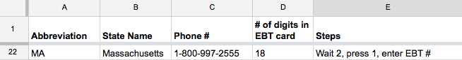

# How to add a state to Balance

## Collect state info (no coding necessary!)

The first step for adding a state is finding some basic information. We keep this info in a Google Spreadsheet here:
<a href="https://docs.google.com/a/codeforamerica.org/spreadsheets/d/12jOXkz1bt7bHzhuXhHYdHhTd45IgrmyVg8-hw93BjIo/edit?usp=sharing" target="_blank">https://docs.google.com/a/codeforamerica.org/spreadsheets/d/12jOXkz1bt7bHzhuXhHYdHhTd45IgrmyVg8-hw93BjIo/edit?usp=sharing</a>

If your state's info is _not_ there — add it!

1) The **existing phone number for checking SNAP balance** in your state. You can find this by searching on Google for "STATENAME snap ebt balance."

2) **\# of digits** an EBT card has in your state (check your state's SNAP web site)

3) The **button push sequence** for checking your balance. Figure this out by calling the phone number and writing down the steps for checking your balance in English. Count the seconds you wait and write that down too.

Here's an example for Massachusetts:




## Write a basic handler (for developers)
1) Fork the Balance repo to your Github account

2) Clone and `cd` into the project:
```
git clone https://github.com/[USERNAME]/balance.git
cd balance
```

3) Check out a feature branch for adding your state, for example:
```
git checkout -b add-massachusetts
```

4) Copy the `example.rb` state handler into a new file named after your state's abbreviation. For Massachusetts, we would do:
```
cp lib/state_handler/example.rb lib/state_handler/ma.rb
```

5) Edit your new state handler file. The top part will look like this:
```ruby
# Step 1. Change "::Example" below to a state abbreviation
# For example, "::PA" for Pennsylvania
class StateHandler::Example < StateHandler::Base

  # Step 2. EXAMPLE — Edit for your state!
  PHONE_NUMBER = '+1222333444'

  # Step 3. EXAMPLE — Edit for your state!
  ALLOWED_NUMBER_OF_EBT_CARD_DIGITS = [16]

  def button_sequence(ebt_number)
    # Step 4. EXAMPLE — Edit for your state!
    "wwww1wwww#{ebt_number}ww"
  end

# …
```
- Add your state's information for the steps shown.
  - Change `StateHandler::Example` to a state abbreviation 
  - For example, `StateHandler::PA` for Pennsylvania
  
- For the button sequence:
  - Use `w` to mean "wait 1/2 of a second"
  - Put `#{ebt_number}` where you would enter the EBT #

With our MA example, our file will now look something like this:

```ruby
class StateHandler::MA < StateHandler::Base
  PHONE_NUMBER = '+18009972555'
  ALLOWED_NUMBER_OF_EBT_CARD_DIGITS = [18]

  def button_sequence(ebt_number)
    "wwww1#{ebt_number}"
  end

# …
```

6) Add and commit your changes:
```
git add .
git commit -m "Initial work on MA handler"
```

## Test your basic handler

1) Now, find one of the project leads and ask to be added as a collaborator to the Heroku dev app set up for this.

2) Once you're a collaborator, add a git remote for the Heroku test app. For MA, this would be:
`git remote add heroku git@heroku.com:balance-summit-ma.git`

3) Now deploy your branch to Heroku, for example:
`git push heroku add-massachusetts:master`

4) Now the fun part! Ask one of the project leads for (1) the Twilio phone number configured for your state (also in [the spreadsheet](https://docs.google.com/a/codeforamerica.org/spreadsheets/d/12jOXkz1bt7bHzhuXhHYdHhTd45IgrmyVg8-hw93BjIo/edit#gid=0)) and (2) the sample EBT card #.

**Send a text message containing the EBT card number to the Twilio phone number!**

Your basic handler will send back the exact transcription of what the phone line says. 

5) Tinker with your button sequence (redeploying it to Heroku to test) if you don't get the balance in the text. A common solution is to add `ww` after `#{ebt_number}` to tell Twilio to wait a second before starting recording.


## Write a balance transcriber
Next, we will deal with invalid card numbers and successful balances.

1) When you can get the balance coming through with your basic handler, open your state handler and **uncomment the `transcribe_balance_response` method**, which will look like this:

```ruby
  def transcribe_balance_response(transcription_text, language = :english)
    mg = MessageGenerator.new(language)

    # Deal with a failed transcription
    # You do not need to change this. :D
    if transcription_text == nil
      return mg.having_trouble_try_again_message
    end

    # Deal with an invalid card number
    ### Step 4. EXAMPLE — Edit for your state! ###
    phrase_indicating_invalid_card_number = "CHANGE ME"

    if transcription_text.include?(phrase_indicating_invalid_card_number)
      return mg.card_number_not_found_message
    end

    # Deal with a successful balance transcription
    ### Step 5. EXAMPLE — Edit for your state! ###
    regex_matches = transcription_text.scan(/(\$\S+)/)
    if regex_matches.count > 1
      ebt_amount = regex_matches[0][0]
      return "Hi! Your food stamp balance is #{ebt_amount}."
    end

    # Deal with any other transcription (catching weird errors)
    # You do not need to change this. :D
    return mg.having_trouble_try_again_message
  end
```

2) Deal with **invalid card numbers**

To write this, first send a text message to your basic handler with the EBT number, but change the first two digits to be `0` (for example, instead of `50771234` send a text with `00771234`).

Look at what gets texted back to you, and look for a unique phrase that is **not** in successful balance responses, **and** which is likely to be transcribed consistently — for example, "invalid card number".

Change the code to put this phrase in there:

```ruby
    phrase_indicating_invalid_card_number = "invalid card number"
```

3) Format a **successful balance transcription**

Next, we want to write some code that takes a successful balance response and formats it a bit more nicely — it should say "Hi! Your food stamp balance is…" and optionally have more information.

In most cases, this is easily done with a regex looking for dollar amounts like `$123.45`.

The example code there is simple — it just looks for the first dollar amount match:

```ruby
    regex_matches = transcription_text.scan(/(\$\S+)/)
    if regex_matches.count > 1
      ebt_amount = regex_matches[0][0]
      return "Hi! Your food stamp balance is #{ebt_amount}."
    end
```

This may even work out of the box for lots of states!

For an example of a more complicated transcription, we can look at California which also provides a cash amount (the second dollar amount read off):

```ruby
    regex_matches = transcription_text.scan(/(\$\S+)/)
    if regex_matches.count > 1
      ebt_amount = regex_matches[0][0]
      cash_amount = regex_matches[1][0]
      return "Hi! Your food stamp balance is #{ebt_amount} and your cash balance is #{cash_amount}."
    end
```
## PR + CELEBRATE!!
1) Commit and push your branch to Github
```
git add .
git commit -m "Finished work on MA!"
git push origin add-massachusetts
```

2) Go to your forked repo and create a pull request


3) PARTY!
- Add your Twitter handle to the [Google Spreadsheet](https://docs.google.com/a/codeforamerica.org/spreadsheets/d/12jOXkz1bt7bHzhuXhHYdHhTd45IgrmyVg8-hw93BjIo/edit#gid=0) so we can send you some love.
- Thank [@daguar](http://www.twitter.com/daguar) for such beautiful code and awesome instructions.
