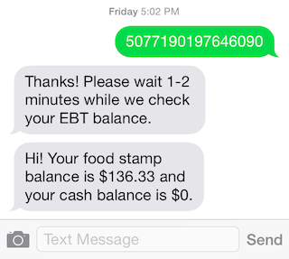

# Balance

[](https://travis-ci.org/codeforamerica/balance)

A text message interface for people to check their EBT card balance for SNAP and other human service benefits



Currently available in:

- California
- Texas
- Pennsylvania
- Alaska
- Virginia
- Oklahoma
- North Carolina
- Florida

If you want to use Balance with real SNAP recipients, check out the [list of official Balance phone numbers](https://github.com/codeforamerica/balance/wiki#phone-numbers).

## What it is

This is a simple Ruby app built on Twilio that creates a text message interface for people to check their food stamp EBT card balance (and cash balance for other programs).

The original idea was by @lippytak with influence from @alanjosephwilliams's experience on Code for America's [health project ideas](https://github.com/codeforamerica/health-project-ideas/issues/34) repo.

This is a project of CFA's Health Lab Team.

## Metrics
Our primary metrics are:
- # of successful balance checks (growth)
- # of unique users with 1+ successful balance checks (growth)
- % of users who check their balance more than once (engagement)

[](http://keep-your-balance.herokuapp.com/)

(click for interactive graph - sorry it's so slow!)

## Contribute
We aren't accepting contributions right now because it takes a lot of work to QA each new state and we don't have it. Sorry about that! If you're really interested and/or work for a gov agency please feel free to get in touch: health-lab@codeforamerica.org.

## Deployment

To deploy on Heroku, close and push the repo, and then set the following environment variables:

- TWILIO_SID
- TWILIO_AUTH

with your Twilio credentials.

Then, go onto your Twilio account and purchase a phone number. Configure that phone number with the following request URLs:

Voice: http://my-balance-url.herokuapp.com/voice_call (choose HTTP POST from dropdown)

Messaging: http://my-balance-url.herokuapp.com (choose HTTP POST from dropdown)


## Running tests

Because we use `.env` for testing, you'll want to run your tests by running:

```
foreman run bundle exec rspec spec
```

## Twilio Console

The `twilio_console.rb` file just gets you a quick Ruby prompt with Twilio clients pre-loaded. This is useful for doing manual responses to users. To use this, you will need to set the environment variables specified in that file.

## Ops Details

### Twilio

We have isolated Twilio subaccounts for the app, under CFA's main account.

- Staging: balance-health-guarino
- Production: balance-production-guarino

Each account has phone numbers attached to it.

For A/B testing different outreach media, we can buy a new phone number on the same Twilio subaccount and point it to the same server URL.

### Servers

We're deployed on Heroku on CFA's main account with both staging and production instances. Currently only @daguar is configured as a collaborator.

### Adding new phone numbers

If you add a new phone number, you will need to restart the app to get it working (this is because we pull down the list of phone numbers and their names when the app starts up, so it requires a restart to refresh this list.)

To do this, simply restart production:

`heroku restart -a balance-production`

## Copyright & License

Copyright Code for America Labs, 2014-2016 — MIT License
